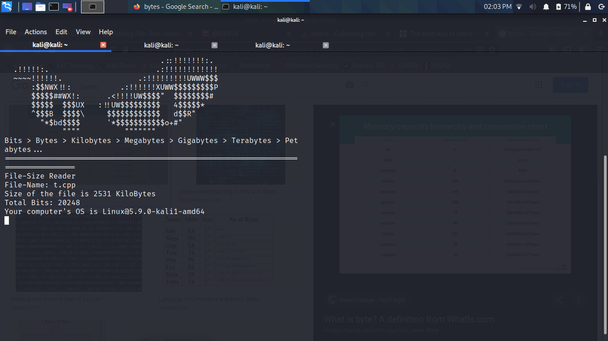

# File-Size-reader
>File Size Reader C++ with OS detection

```cpp
ifstream in_file(file, ios::binary);
in_file.seekg(0, ios::end);
int file_size = in_file.tellg();
```
**Code Snippet above Opens  and Reads the file size**

```cpp
 struct utsname name;
        if(uname(&name)) exit(-1);
        printf("\nYour computer's OS is %s@%s\n", name.sysname, name.release);

```
**and here Code Snippet above detects the operating system**

# Appearance during runtime 

   

